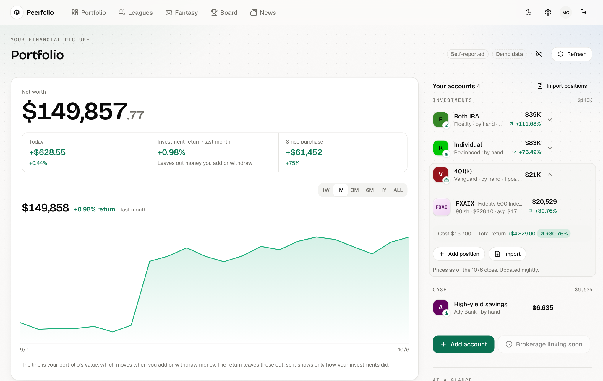
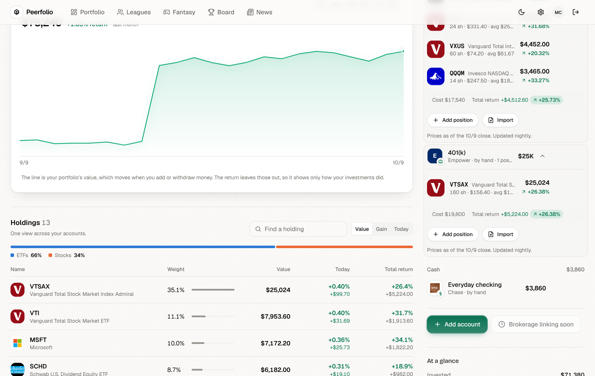
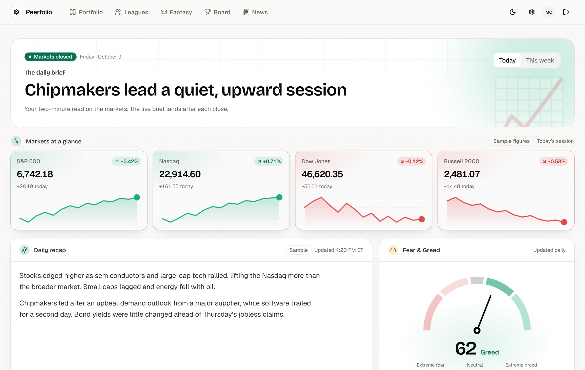
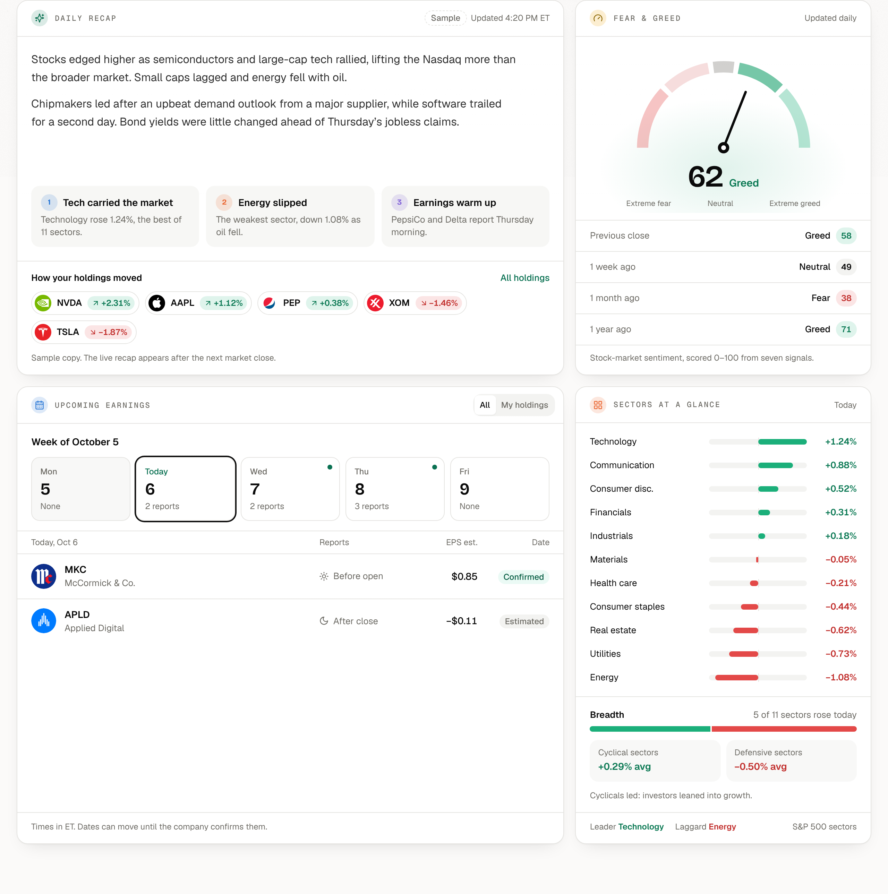
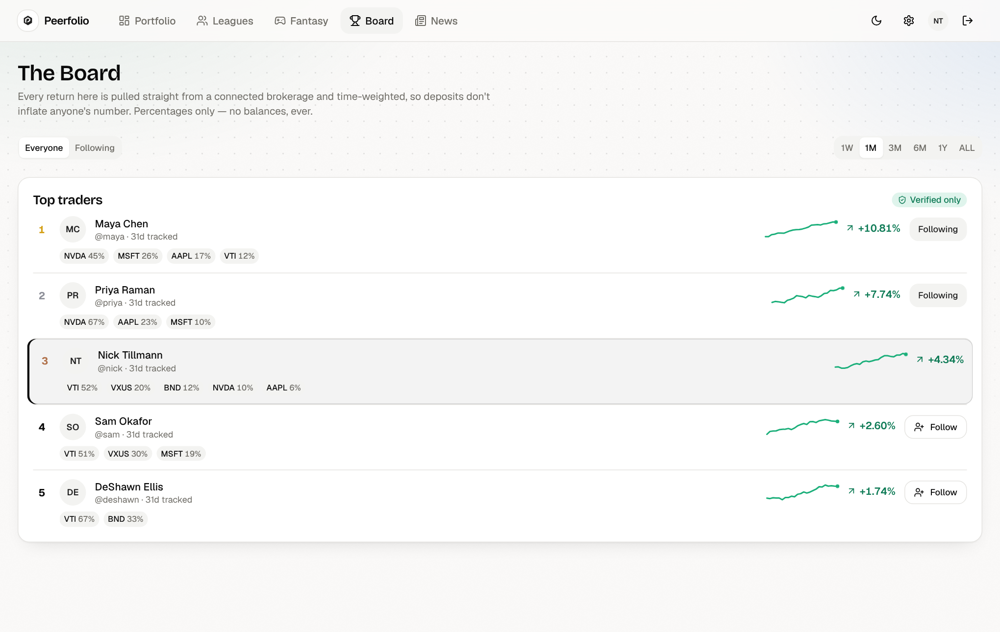
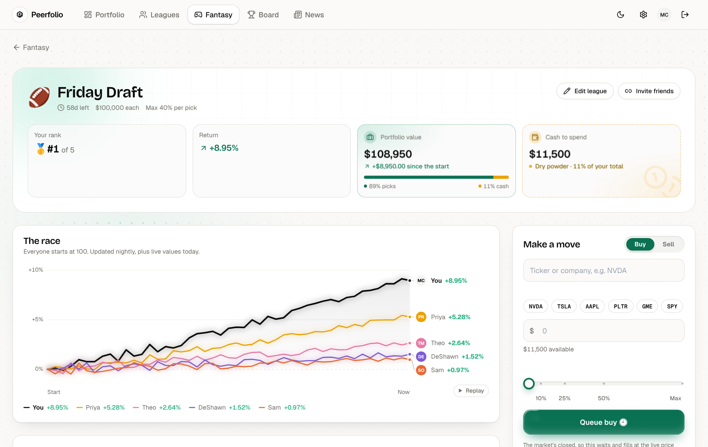
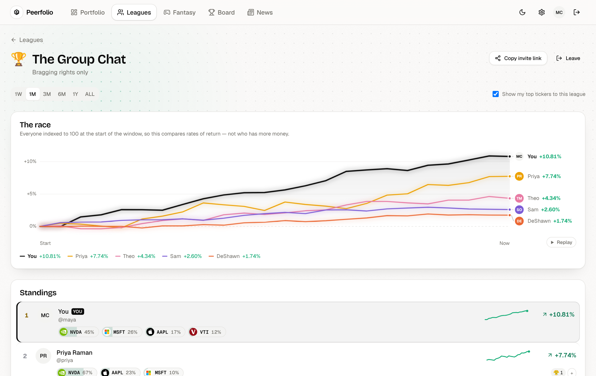

# Peerfolio

Social investing built around one rule: **percentages are public, dollars never
are.**

Blossom, AfterHour and Robinhood Social are public feeds with follower counts
and dollar amounts. Peerfolio is five surfaces on one engine:

- **Portfolio** — your own net worth, accounts and positions in one place, with
  a time-weighted return that ignores deposits and withdrawals. Only you see it.
- **Leagues** — small private groups of actual friends, ranked on return.
- **Fantasy** — play-money leagues where everyone starts with the same cash,
  picks stocks and races. Nothing here touches a real balance.
- **The Board** — a public leaderboard of top investors, where every return is
  pulled from a connected brokerage rather than typed in.
- **News** — a daily and weekly market recap, index moves, Fear & Greed and the
  week's earnings, so there's something to read before the next move.

Returns are **time-weighted**, so deposits don't count as performance. Whoever
adds the most cash doesn't win; that's what makes a ranking worth reading.

## Screenshots

All screenshots use invented demo data, not real accounts.

### Portfolio

Net worth, accounts and positions in one view. The return leaves deposits out.



Below it, every holding across every account rolled up into one list, with
allocation, today's movers and the leagues you're in.



### News



The recap, Fear & Greed, the week's earnings and sector moves.



### The Board

Public, verified-only, percentages only.



### Fantasy

Play-money leagues with a shared starting balance, an optional cap per pick and
an end date. Orders placed while the market is closed wait for the open.



### Leagues

A private group ranked on percentage return. Everyone is indexed to 100, so the
chart compares rates of return, not who has more money.



## What's shared, and what isn't

| Shared | Never shared |
|---|---|
| Percentage return, time-weighted | Account balances or net worth |
| Top tickers as a share of your own portfolio (opt-in) | Position sizes in dollars |
| Handle, avatar, bio | Email address |

Public profiles are opt-in and off by default.

## Quickstart

No hosted database, OAuth app or Plaid keys needed to see the app running:

```sh
docker compose up -d                            # Postgres on :5433
npm install
cp apps/web/.env.example apps/web/.env.local    # generate the two secrets it names
npm run db:migrate --workspace=@repo/web
npm run db:seed --workspace=@repo/web           # five demo portfolios, 120 days each
npm run dev
```

Then open **http://localhost:3000/dev-login** and sign in as any seeded user.

Two pages can also be looked at without signing in, on invented data:
**/preview/portfolio** and **/preview/news**. Both 404 in production builds.

Port 3000 taken? `PORT=3200 npm run dev --workspace=@repo/web`. Set
`NEXTAUTH_URL` to the same port in `.env.local` — if it disagrees, sign-in
hangs instead of failing loudly.

The developer login is off by default and never runs in production. Locally it
needs only `ENABLE_DEV_LOGIN=true` in a non-production build. It also works on a
Vercel **preview** deployment, so a branch can be reviewed without an OAuth app
per preview URL, but only when all of these are set on the Preview environment:

- `ENABLE_DEV_LOGIN=true`
- `DEV_LOGIN_SECRET`: a passcode of at least 16 characters (`openssl rand -base64 24`)
- `DEV_LOGIN_EMAILS`: comma-separated emails of the existing accounts it may open
- optionally `DEV_LOGIN_DEMO_DATABASE=true`: you're stating the preview's database is disposable demo data, which lets the login apply pending migrations to it

On a preview, an allowlisted account that doesn't exist yet is created on first sign-in along with a demo world (four other players, "The Group Chat" league, and a "Friday Draft" fantasy league with standings and a trade feed), so a fresh demo database needs no seeding. Point previews at a database that holds only demo accounts. A request needs both
the passcode and an allowlisted email, and `VERCEL_ENV=production` always turns the
login off, so the route 404s and the provider isn't registered there.

For the real thing you need a Postgres URL (Neon and Supabase both work),
Google OAuth credentials and Plaid sandbox keys. `apps/web/.env.example`
documents every variable, including how to generate `ENCRYPTION_KEY` and
`CRON_SECRET`.

### Daily snapshots

`/api/cron/snapshot` is what makes performance history exist at all. Plaid
exposes no historical portfolio value, so the series only grows forward from
the day someone connects and can never be backfilled. Miss a day and that day
is gone for everyone.

The daily snapshot is scheduled in `apps/web/vercel.json` at 22:30 UTC.
Confirm that your Vercel plan enables that job and inspect its run history. If
you use an external scheduler instead, avoid also scheduling a duplicate job:

- **Vercel dashboard** — Settings → Cron Jobs, path `/api/cron/snapshot`.
- **Any external scheduler** (cron-job.org, GitHub Actions, your own box):

  ```sh
  curl -H "Authorization: Bearer $CRON_SECRET" https://<your-domain>/api/cron/snapshot
  ```

The endpoint refuses without a matching `CRON_SECRET`, so it is safe to expose.

**Prices.** `/api/cron/prices` refreshes live quotes and picks up the official
close. `.github/workflows/prices.yml` calls it every 5 minutes during market
hours and every 10 minutes for a few hours after the close. Add one repository secret
(Settings → Secrets and variables → Actions): `CRON_SECRET`, the same value as
in Vercel. It calls `https://www.peerfolio.org` unless you set a `PEERFOLIO_URL`
repository variable. A run
turns red when it tried to refresh and nothing arrived.

Before writing snapshots it reprices manual positions from the previous
session's closes (`MASSIVE_API_KEY`). That's two market data calls a night, one
for US stocks and ETFs and one for crypto, however many positions exist.

### Plaid webhooks

Point `PLAID_WEBHOOK_URL` at `https://<your-domain>/api/plaid/webhook`.
Requests are signature-verified. Without a reachable webhook, connections that
fall out of auth go stale silently instead of prompting a reconnect.

## Verified vs. manual accounts

Accounts carry a **source**. Plaid-connected accounts are `plaid`; typed-in
ones are `manual`.

Manual accounts exist so people can start building history before their
brokerage is connectable — waiting costs history permanently. Manual
portfolios play in private leagues. **Only Plaid-verified portfolios can rank
on the public board**, so nothing self-reported is ever presented as verified.
That makes verification the reason to connect, rather than a prerequisite to
launching.

## Architecture

```
apps/web/src
├── app/(app)/        Signed-in surfaces: dashboard (Portfolio), leagues, fantasy,
│                     board, news, settings
├── app/preview/      Sign-in-free Portfolio and News pages on sample data
├── app/u/[handle]/   Public trader profiles
├── app/api/          Route handlers (every Plaid route is session-guarded)
│                     plus the cron jobs for snapshots, prices and news
├── components/       UI primitives, hand-rolled SVG charts, feature components
├── db/               Drizzle schema and client (server-only)
└── lib/              Plaid client + sync, returns math, crypto, formatting
```

**Security notes.** Plaid access tokens are encrypted with AES-256-GCM and
never leave the server — no route returns one, and nothing is kept in
`localStorage`. `src/db/index.ts` imports `server-only`, so a client component
that reaches for the database fails the build rather than shipping the driver
to the browser.

## Scripts

| Command | What it does |
|---|---|
| `npm run dev` | Dev server on :3000 |
| `npm run build` | Build all workspaces |
| `npm run lint` | ESLint, zero warnings tolerated |
| `npm run check-types` | `tsc --noEmit` |
| `npm test` | Unit tests (`node:test`, no framework) |
| `npm run db:generate --workspace=@repo/web` | Write a migration from schema changes |
| `npm run db:migrate --workspace=@repo/web` | Apply migrations |
| `npm run db:studio --workspace=@repo/web` | Drizzle Studio |

## Charts

Charts are hand-rolled SVG rather than a charting library — that's what let the
dashboard bundle drop from 303 kB to 128 kB of first-load JS.

The palette is validated for colour-vision deficiency, and the slot **ordering**
in `globals.css` is the accessibility mechanism, not decoration. Re-run the
validator before reshuffling it. Gain and loss always ship an arrow and a sign
alongside the colour, because that red/green pair sits in the CVD warn band and
colour alone wouldn't be readable for everyone.
